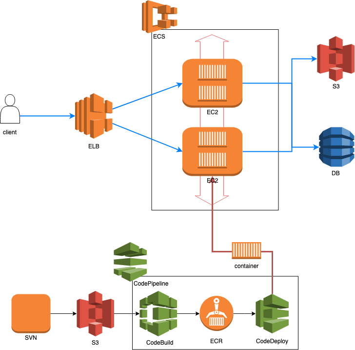

# svn 자동화 배포 및 ECS 활용

## 전체 구성

## 개발 환경

- [docker](./etc/docker.md)
- [terraform](./etc/terraform.md)
- [aws-cli 설치 및 구성](https://docs.aws.amazon.com/ko_kr/streams/latest/dev/kinesis-tutorial-cli-installation.html)
- [git](https://git-scm.com/book/ko/v2/%EC%8B%9C%EC%9E%91%ED%95%98%EA%B8%B0-Git-%EC%84%A4%EC%B9%98)

## 계획

- 1주차(온라인)
    - [ ] [docker](./etc/docker.md)
    - [ ] [SVN 구성](./etc/svn.md)
- 2주차(온라인)
    - [ ] [terraform 사용](./etc/terraform.md)
    - [ ] [git](./etc/git.md)
- 3주차(오프라인) - 7월 31일
    - [ ] [aws service 소개](./week1.md)
- 4주차(오프라인) - 8월 7일
    - [ ] [ECS 구성 및 ELB 구성](./week2.md)
- 5주차(오프라인) - 8월 14일
    - [ ] SVN 자동화 배포 pipeline 구축
- 6주차(오프라인) - 8월 21일
    - [ ] codedeploy
    - [ ] review