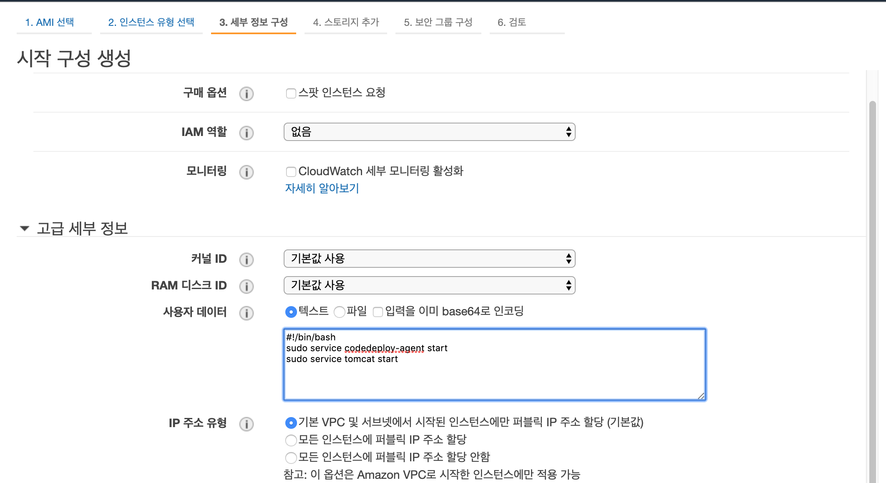

1. 권한 생성

[code deploy 권한 생성](https://docs.aws.amazon.com/ko_kr/codedeploy/latest/userguide/getting-started-create-service-role.html)

2. 시작 구성




```bash
#!/bin/bash
sudo yum update -y
sudo yum install ruby -y
cd /home/ec2-user
sudo chmod +x ./install
sudo ./install auto
sudo service codedeploy-agent start
sudo service tomcat start
```

3. auto scaling 그룹 구성