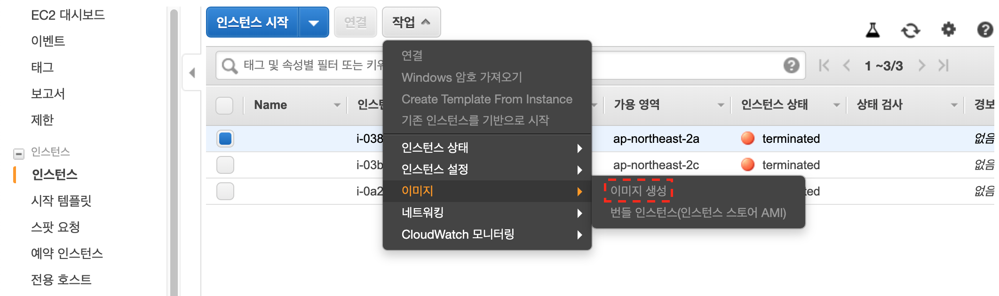

# Tomcat on Amazon Linux
#tomcat

## CodeDeploy agent 설치 및 실행

### 1. 권한 설정


```json
{
          "Effect": "Allow",
          "Action": [
            "s3:Get*",
            "s3:List*"
          ],
          "Resource": [
            "arn:aws:s3:::replace-with-your-s3-bucket-name/*",
            "arn:aws:s3:::aws-codedeploy-us-east-2/*",
            "arn:aws:s3:::aws-codedeploy-us-east-1/*",
            "arn:aws:s3:::aws-codedeploy-us-west-1/*",
            "arn:aws:s3:::aws-codedeploy-us-west-2/*",
            "arn:aws:s3:::aws-codedeploy-ca-central-1/*",
            "arn:aws:s3:::aws-codedeploy-eu-west-1/*",
            "arn:aws:s3:::aws-codedeploy-eu-west-2/*",
            "arn:aws:s3:::aws-codedeploy-eu-west-3/*",
            "arn:aws:s3:::aws-codedeploy-eu-central-1/*",
            "arn:aws:s3:::aws-codedeploy-ap-east-1/*",
            "arn:aws:s3:::aws-codedeploy-ap-northeast-1/*",
            "arn:aws:s3:::aws-codedeploy-ap-northeast-2/*",
            "arn:aws:s3:::aws-codedeploy-ap-southeast-1/*",        
            "arn:aws:s3:::aws-codedeploy-ap-southeast-2/*",
            "arn:aws:s3:::aws-codedeploy-ap-south-1/*",
            "arn:aws:s3:::aws-codedeploy-sa-east-1/*"
          ]
        }
```

### 2. agent 설치

```bash
sudo yum update
sudo yum install ruby
sudo yum install wget
cd /home/ec2-user
wget https://${var.code_deploy_resource_kit_bucket}.s3.${var.code_deploy_resource_kit_region}.amazonaws.com/latest/install
chmod +x ./install
sudo ./install auto
```

### 2. agent 실행

```bash
# 실행
sudo service codedeploy-agent start
```

## Tomcat 설치 및 실행
```bash
sudo yum install java-1.8.0-openjdk
sudo yum install tomcat tomcat-admin-webapps tomcat-webapps tomcat-docs-webapp -y
```

```bash
# 실행
sudo service tomcat start
# tomcat path: /usr/share/tomcat
```

## ami 생성


