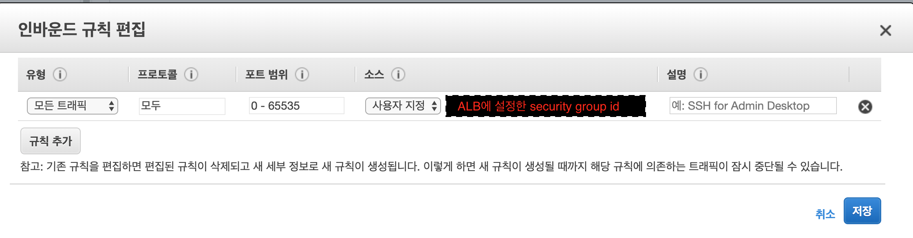

# ECS & ALB

## 1. 배포 이미지 ECR에 배포

```bash
# 1. Docker 클라이언트에서 레지스트리에 인증하는 데 사용할 로그인 명령을 검색후 docker login
$(aws ecr get-login --no-include-email --region ap-northeast-2)

# 2.  Docker 이미지를 빌드합니다.
docker build -t <ECR repository 이름> .

# 3. 빌드 완료 후, 현재 리포지토리에 이미지를 푸시할 수 있도록 해당 이미지에 태그를 지정합니다.
docker tag <ECR repository 이름>:<TAG> <ECR repository URI>:<TAG>

# 4. 다음 명령을 실행하여 이 이미지를 새로 생성한 AWS 리포지토리로 푸시합니다.
docker push <ECR repository URI>:<TAG>
```

## 2. ALB 생성

### 1) 로드 밸런서 구성

- alb 이름 등록
- 리스너(http/https)
- 가용 영역

### 2) 보안 설정 구성

- HTTPS 인증서 등록

### 3) 보안 그룹 구성

- security group 등록(ECS container로 라우팅 설정)

### 4) 라우팅 구성 

- target group 등록

### 5) 대상 등록

## 3. ECS task-definition

### 1) 시작 유형 호환성 선택

- ec2 선택

### 2) 작업 및 컨테이너 정의 구성

- [작업 역할](https://docs.aws.amazon.com/ko_kr/AmazonECS/latest/developerguide/task-iam-roles.html) - container 수준의 iam 역할

- [네트워크 모드](https://docs.aws.amazon.com/ko_kr/AmazonECS/latest/developerguide/task_definition_parameters.html#network_mode) - default로 설정하여 사용
    


### 3) 작업 실행 IAM 역할

작업 정의를 등록할 때 작업의 컨테이너가 컨테이너 이미지를 가져오고 사용자를 대신하여 CloudWatch에 컨테이너 로그를 게시하도록 허용하는 작업 실행 역할을 제공할 수 있습니다.

### 4) 작업 크기

- 컨테이너 정의
    
    - 포트 매핑

        host port는 0(dynamic port)으로 할당하고 컨테이너 포트는 container에서 사용하는 port 할당

    - 메모리 제한

        하드 제한(메모리)을 지정한 경우, 컨테이너가 그 제한을 초과하려 하면 (컨테이너는) 중지됩니다. 소프트 제한(memoryReservation)을 지정한 경우, ECS는 컨테이너에 그만큼의 메모리 용량을 확보합니다. 그러나 컨테이너는 하드 제한까지(지정된 경우) 또는 컨테이너 인스턴스의 모든 가용 메모리 중 먼저 도달하는 양까지 요청할 수 있습니다. 둘 다 지정하는 경우, 하드 제한이 소프트 제한보다 커야 합니다.

## 4. ECS cluster 생성

### 1) 클러스터 템플릿 선택

`EC2 Linux + 네트워킹` 선택

### 2) 클러스터 구성

네트워킹에서 보안 그룹설정 시(alb에서 들어오는 traffic만 허용하는 방법)



## 5. ECS service 생성

## 참고사항
- [작업 배치 전략](https://docs.aws.amazon.com/ko_kr/AmazonECS/latest/developerguide/task-placement-strategies.html)