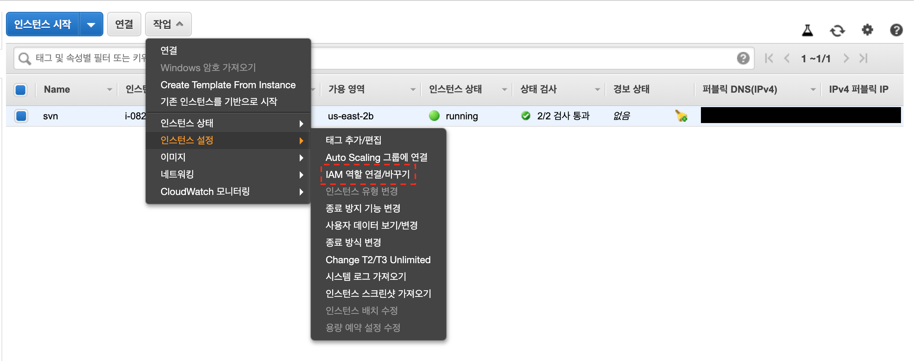

# svn

## svn server 구성

### Docker

```bash
docker run \
    --name my-svn-server \
    --detach \
    --publish 3690:3690 \
    --volume "${PWD}/data/:/var/opt/svn/new-repo" \
    garethflowers/svn-server

docker exec -it my-svn-server svnadmin create new-repo
```

### amazon linux

```bash
sudo yum update
sudo yum install subversion
sudo mkdir /home/svn

cd /home/svn
sudo svnadmin create --fs-type fsfs repos

cd /home/svn/repos/conf
# authz, passwd, svnserve.conf 수정
svnserve -d -r /home/svn/repos/ # svn 서버 시작
```

#### 문제점

```bash
# svn commit 시 error: '/home/svn/repos/db/txn-current-lock' 를 열 수 없습니다: Permission denied
# 같은 그룹(g), 다른 사용자(o)에게 쓰기 권한을 부여.
chmod -R go+w/path/tomy/svn/repos/ 
```

## 사용법
```bash
svn checkout svn://<ip>:3690 --username=<username> --password=<password>

svn add <file>

[image:739F880E-5402-41F0-B50A-DE5239076C51-2244-0002191B50D96EE4/스크린샷 2019-07-24 오후 10.07.53.png]
svn commit -m "<commit message>"
```

## hook
저장소를 생성하면 훅 스크립트 템플릿이 같이 생성된다.
```
-rwxr-xr-x. 1 lesstif rnd 2062 2014-03-18 23:12 post-commit.tmpl
-rwxr-xr-x. 1 lesstif rnd 1638 2014-03-18 23:12 post-lock.tmpl
-rwxr-xr-x. 1 lesstif rnd 2289 2014-03-18 23:12 post-revprop-change.tmpl
-rwxr-xr-x. 1 lesstif rnd 1567 2014-03-18 23:12 post-unlock.tmpl
-rwxr-xr-x. 1 lesstif rnd 3426 2014-03-18 23:12 pre-commit.tmpl
-rwxr-xr-x. 1 lesstif rnd 2434 2014-03-18 23:12 pre-lock.tmpl
-rwxr-xr-x. 1 lesstif rnd 2786 2014-03-18 23:12 pre-revprop-change.tmpl
-rwxr-xr-x. 1 lesstif rnd 2122 2014-03-18 23:12 pre-unlock.tmpl
-rwxr-xr-x. 1 lesstif rnd 3163 2014-03-18 23:12 start-commit.tmpl
```

- 훅 파일은 확장자인 .tmpl 을 없애고훅의 이름은 이벤트가 완료되기 전에 실행되는지 후에 실행되는지 여부에 따라 pre 나 post 접두사를 붙이고 - 뒤에 이벤트 이름을 지정하면 된다.
- 훅은 실행 속성이 있어야 하므로 작성은 쉘 스크립트, PERL, PHP, Python, Ruby, 자바등 언어의 제한 없이 선호하는 개발 언어를 사용하여 작성하고chmod +x명령어로 실행 속성을 부여해 주면 된다.

### hook 설정 - s3로 zip file 전송

1. post-commit.tmpl file이름을 post-commit으로 변경

2. 실행 권한 설정
```bash
sudo chmod a+x post-commit
```

3. post-commit script 작성
```bash
CHECKOUT_FOLDER="/home/ec2-user/test"
ZIP_FILE_NAME="output.zip"
OUTPUT_ZIP_PATH="/home/ec2-user/$ZIP_FILE_NAME"

# checkout할 folder가 없는 경우 folder 생성
if [ ! -d "$CHECKOUT_FOLDER" ]; then
    mkdir "$CHECKOUT_FOLDER"
fi

# commit한 code 받아오기
cd "$CHECKOUT_FOLDER"
svn checkout svn://localhost --username="<svn username>" --password="<svn password>"
echo "checkout successed" >&2

# zip file 생성
cd "$CHECKOUT_FOLDER" && rm -rf .svn && zip -rm "$OUTPUT_ZIP_PATH" .
echo "zip successed" >&2

# s3로 zip file 전송
aws s3 cp "$OUTPUT_ZIP_PATH" "s3://<bucket-name>/$ZIP_FILE_NAME"
rm "$OUTPUT_ZIP_PATH"
```

4. ec2 instance에 s3 권한 부여




## Reference
[hook script 로 svn 동작 제어하기](https://www.lesstif.com/pages/viewpage.action?pageId=18220003)